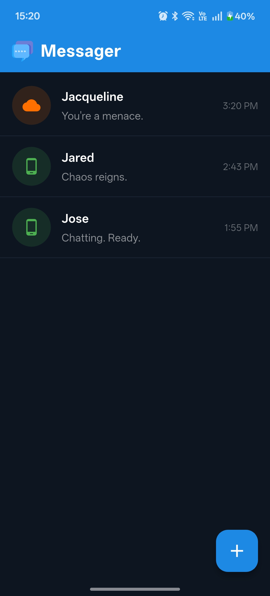
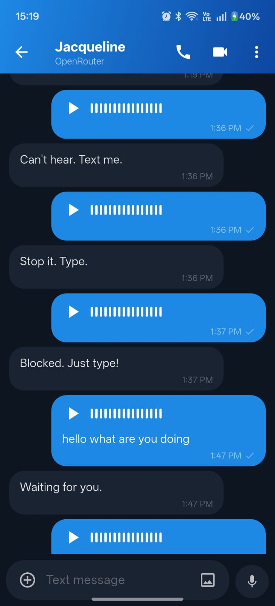
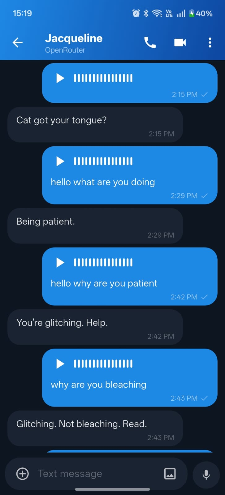

# Messager

A sleek, open-source AI chat app built with Flutter. Chat with local models (LiteRT), Google Gemini, or 100+ models via OpenRouter.


## Features

- **Multiple AI Backends**
  - **LiteRT** — Run models locally on-device (single `.litertlm` file)
  - **Gemini** — Google's Gemini API
  - **OpenRouter** — Access 100+ models via one API key
- **Messenger-Style UI** — Dark theme with iMessage/WhatsApp-inspired bubbles
- **Voice Messages** — Speech-to-text input with animated waveform visualizer
- **Text-to-Speech** — AI responses are read aloud when you send a voice message
- **Swipe to Reply** — Swipe any message right to quote it in your next prompt
- **Message Reactions** — Long-press AI messages to react with emoji
- **Read Receipts** — Sent → Delivered → Read tick indicators on your messages
- **Typing Personas** — Fun animated status texts while the AI is thinking
- **Attachments** — Send images and `.txt` files alongside your messages
- **Custom System Prompts** — Tweak personality per conversation
- **Conversation Starters** — Fun prompt suggestions when starting a new chat
- **Local Database** — All chats stored locally with SQLite

## Screenshots





## Getting Started

### Prerequisites
- [Flutter](https://docs.flutter.dev/get-started/install) SDK 3.12+
- Android Studio / Xcode (for mobile builds)
- An API key for [Gemini](https://aistudio.google.com) or [OpenRouter](https://openrouter.ai) (optional, for cloud models)

### Installation

```bash
git clone https://github.com/yashasnadigsyn/messager.git
cd messager
flutter pub get
flutter run
```

### Building for Release

```bash
# Android
flutter build apk --release

# iOS
flutter build ios --release
```

## Project Structure

```
lib/
├── backends/          # AI backend implementations (LiteRT, Gemini, OpenRouter)
├── data/              # SQLite database helper
├── models/            # Data models (Conversation, Message)
├── screens/           # UI screens (Home, Chat, New Chat)
└── main.dart          # App entry point
```

## Tech Stack

- **Flutter** — Cross-platform UI framework
- **sqflite** — Local SQLite database
- **speech_to_text** — Voice input
- **flutter_tts** — Text-to-speech output
- **audioplayers** — Audio playback for voice messages
- **google_generative_ai** — Gemini SDK
- **dio / http** — Network requests for OpenRouter

## Contributing

Contributions are welcome! This is a fun, open-source project — no revenue goals, just cool features.

1. Fork the repository
2. Create a feature branch (`git checkout -b feature/amazing-feature`)
3. Commit your changes (`git commit -m 'Add amazing feature'`)
4. Push to the branch (`git push origin feature/amazing-feature`)
5. Open a Pull Request

## License

MIT
